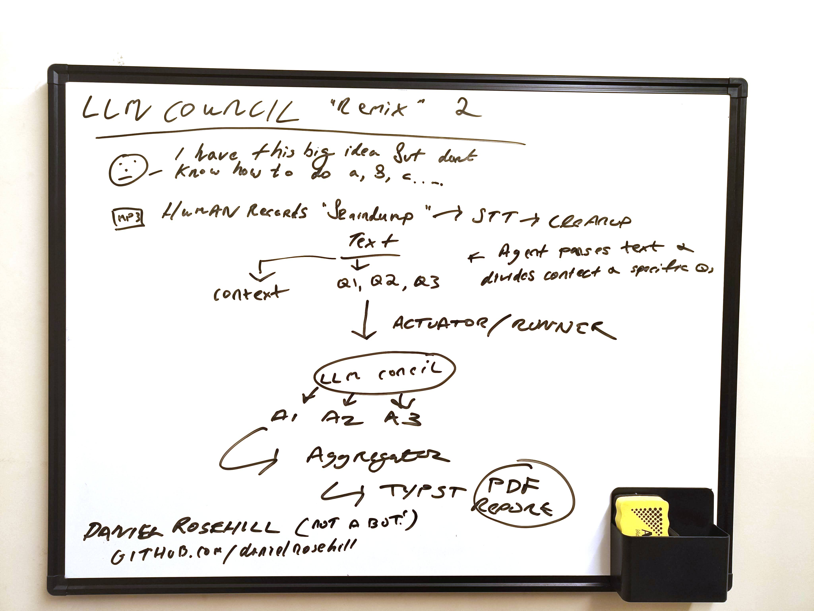
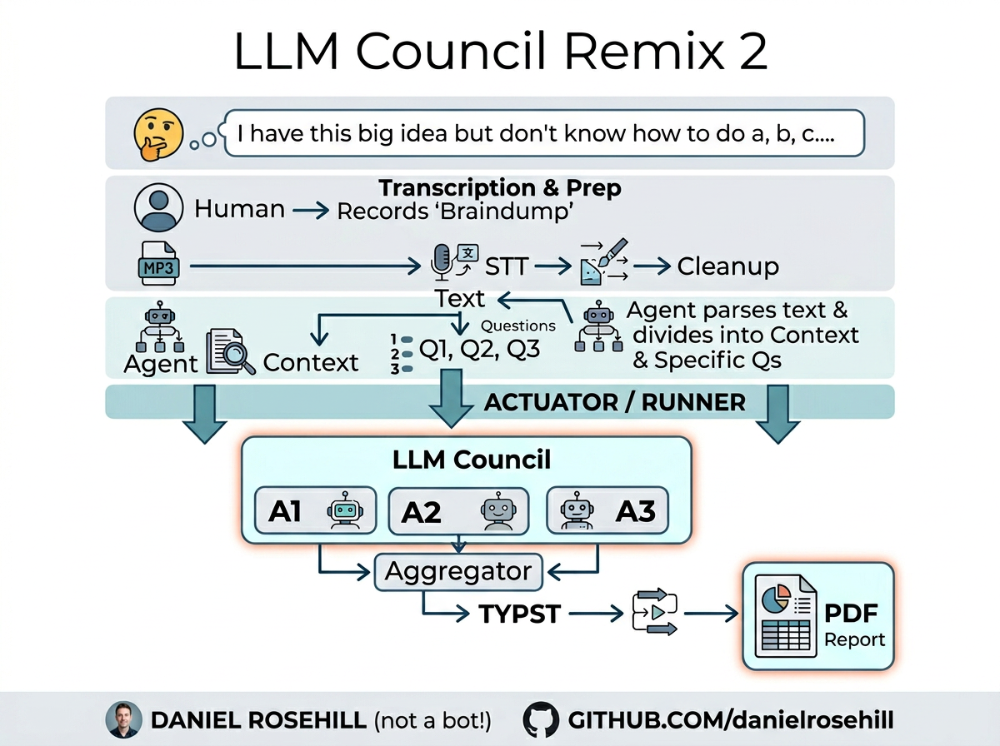

# LLM Council V3 — "Remix" 2

A remix of Andrej Karpathy's [`karpathy/llm-council`](https://github.com/karpathy/llm-council) with a voice-first, batch-oriented twist.

## What I'm trying to build

The original LLM Council is a chat-style UI: one question in, multiple models answer, they rank each other, a Chairman model synthesises a final response.

This remix keeps the council pattern but changes the front end and the batching model. Instead of typing one question at a time, the idea is:

1. **Braindump** — I record an MP3 of myself rambling: "I have this big idea but don't know how to do a, b, c…"
2. **STT + cleanup** — audio → transcript → light cleanup pass.
3. **Parse** — an agent reads the cleaned transcript and splits it into:
   - **Context** (shared background for every question)
   - **Q1, Q2, Q3 …** (the individual questions buried in the braindump)
4. **Actuator / Runner** — for each question, fan out Context + Q to the council via [OpenRouter](https://openrouter.ai/).
5. **LLM Council** — multiple models (A1, A2, A3 …) each answer, then review each other's answers, then a Chairman model produces a final synthesised response (same pattern as Karpathy's).
6. **Aggregator** — collects all final answers across Q1…Qn.
7. **Typst** — render the aggregated Q&A into a typeset **PDF report**.

So the loop is: *ramble in, typeset PDF out — with a council debate in the middle.*

## Whiteboard sketch

The concept, scribbled out:

Cleaned-up diagram version (via Nano Banana):

## Stack (planned)

- **API**: OpenRouter (same as upstream — one key, many models).
- **STT**: Gemini or Whisper, depending on latency/quality preference.
- **Council & Chairman**: configurable roster via OpenRouter model IDs.
- **Typesetting**: Typst for the final PDF.

## Relationship to upstream

- Upstream (`karpathy/llm-council`): interactive chat UI, one question at a time.
- This repo: voice-in / PDF-out batch pipeline, same council/chairman scoring underneath.

Not a fork — a reimplementation around a different input and output surface. Credit to Karpathy for the council pattern that sits at the heart of it.

---

Daniel Rosehill (not a bot) · [github.com/danielrosehill](https://github.com/danielrosehill)
